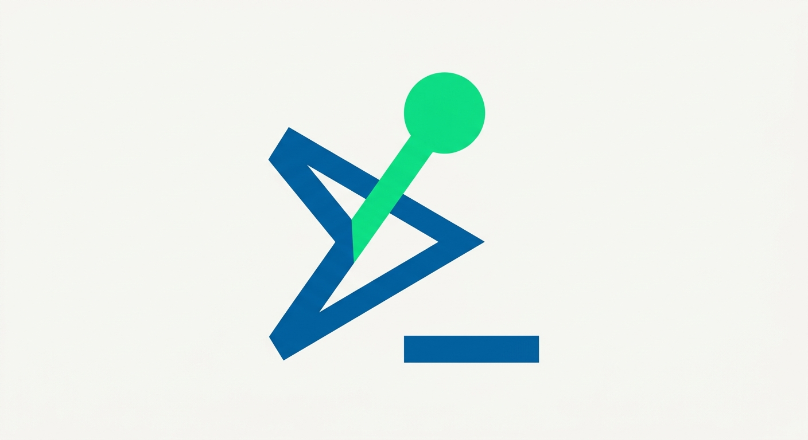
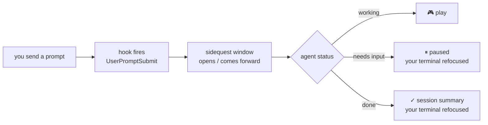

<p align="center">
  
</p>

<h1 align="center">sidequest</h1>
<p align="center"><b>Play a game while your coding agent works — instead of doomscrolling.</b></p>

<p align="center">
  <a href="LICENSE"></a>
  <a href="https://www.npmjs.com/package/sidequest-cli"></a>
  <a href="https://www.npmjs.com/package/sidequest-cli"></a>
  <a href="https://github.com/azamoviich/sidequest/stargazers"></a>
</p>

```bash
npm install -g sidequest-cli
sidequest --setup
```

Send Claude Code (or Cursor, or GitHub Copilot CLI) a prompt like normal. A game pops up on its own. It knows the difference between **still working**, **blocked and needs you**, and **done** — and jumps back to your terminal the instant it needs you, not a second later.



No hooks installed? No problem — wrap *any* command directly and it works the exact same way, agent or not:

```bash
sidequest -- npm install
sidequest -- docker build -t app .
sidequest -- claude -p "refactor the auth module" --dangerously-skip-permissions
```

---

## What you actually get

**7 games**, all playable straight from one menu — no config, no setup required to just play:

| | |
|---|---|
| 🐍 **Snake** | Classic, difficulty-scaled speed, gradient body, doesn't move until you press a key |
| 🟩 **Wordle** | 6 guesses, colored tiles, on-screen keyboard, streak tracking — validated against a real ~16,000-word dictionary |
| 🧠 **Trivia** *(live)* | Mixed / Movies / Music / Science / Geography — pulled fresh from [Open Trivia DB](https://opentdb.com), Kahoot-style colored answer blocks, falls back to a bundled question set if you're offline |
| ⌨️ **Coding Quiz** | Frontend / Backend / Node.js / Algorithms / Git — you **type** the answer, not multiple choice. Real questions: Big-O, git commands, SQL, JS/Python gotchas |

Difficulty (easy/medium/hard, one setting for everything) actually changes the *content* — fewer/more multiple-choice options **and** the real difficulty of the trivia questions fetched from the API, not just cosmetic.

## Two ways to run it

**Watch mode** — the "does this automatically" mode. One-time setup, then it just works:

```bash
sidequest --setup      # pick Claude Code / Cursor / Copilot CLI, global or per-project
```

From then on: send your agent a prompt → a game window opens (or comes forward if one's already open) → status flips live between **● working**, **● needs you!**, and **✓ finished** → the moment it needs you or finishes, your original terminal is automatically refocused. You never have to go looking for it.

```bash
sidequest watch         # can also be run manually — no setup or hooks required
sidequest                # bare command, opens the menu directly, nothing to wait on
```

**Wrap mode** — the "works with literally anything" mode:

```bash
sidequest -- <any command>
```

Runs the command in the background, drops you into the game, hands you the exit code + output the instant it finishes. No hooks, no setup, no agent-specific integration — just process spawning, so it works with any CLI tool that exists.

## Agent hook support

| Agent | Status |
|---|---|
| **Claude Code** | ✅ Verified — `UserPromptSubmit`/`Stop`/`Notification` hooks, confirmed against official docs and tested live |
| **Cursor** | ⚠️ Best-effort — v1.7+ `hooks.json` schema implemented, not independently verified live |
| **GitHub Copilot CLI** | ⚠️ Best-effort — only the documented "waiting for input" event is wired up |
| **Aider / anything else** | Use wrap mode — no hook mechanism exists, but wrap mode works regardless |

`sidequest --setup` only ever adds/merges its own hook entries into your existing config — it never touches or removes anything else already there.

## Install

```bash
npm install -g sidequest-cli
```

Or build from source:

```bash
git clone https://github.com/azamoviich/sidequest
cd sidequest
npm install && npm run build && npm link
```

## Found a bug?

Open an issue: [github.com/azamoviich/sidequest/issues](https://github.com/azamoviich/sidequest/issues), or email **muhammadamin.nazirov@mail.ru**.

*Open to new opportunities.*

## Why it's not just another wrapper script

- **Real live data, not a static toy.** Trivia comes from an actual API with real category/difficulty filtering — not a hardcoded list you'll memorize in a week.
- **Terminal-native visuals with zero emoji dependency.** Everything (colored answer blocks, flag-style bands, gradient snake) is rendered with real ANSI colors, so it looks right on every terminal — no tofu boxes where an emoji should be.
- **It closes the loop.** This isn't "open a game and hope you remember to check back" — it tracks agent state and brings your terminal back to you automatically the second it matters.
- **Cross-agent by design, not by accident.** One internal status protocol (`~/.sidequest/status.json`), N thin per-agent hook adapters behind it — adding support for a new agent is a new adapter file, not a rewrite.

## License

MIT — see [LICENSE](LICENSE).
