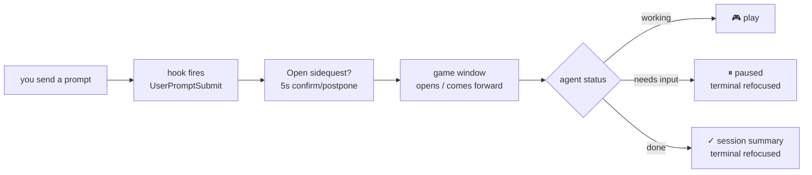

<p align="center">
  
</p>

<h1 align="center">sidequest</h1>
<p align="center"><b>Play a game while your coding agent works — instead of doomscrolling.</b></p>

<p align="center">
  <a href="LICENSE"></a>
  <a href="https://www.npmjs.com/package/sidequest-cli"></a>
  <a href="https://www.npmjs.com/package/sidequest-cli"></a>
  <a href="https://github.com/azamoviich/sidequest/stargazers"></a>
</p>

```bash
npm install -g sidequest-cli
sidequest --setup
```

Send Claude Code (or Cursor, or GitHub Copilot CLI) a prompt like normal. A game pops up on its own — with a heads-up first ("Open sidequest?", 5s to confirm or postpone, not an instant window-yank). It knows the difference between **still working**, **blocked and needs you**, and **done**, and brings your terminal back the instant it needs you.



No hooks installed? No problem — wrap *any* command directly and it works the exact same way, agent or not:

```bash
sidequest -- npm install
sidequest -- docker build -t app .
sidequest -- claude -p "refactor the auth module" --dangerously-skip-permissions
```

---

## What you actually get

**62 games across 8 categories**, all playable straight from one menu — no config, no setup required to just play:

| | |
|---|---|
| ☀️ **Daily Challenge** | One puzzle a day, same for everyone (deterministic by date) — logic, math, pattern recognition, riddles, lateral thinking, spot-the-bug, estimation, cryptography |
| 🎮 **Games** | Snake, Wordle, Tic-Tac-Toe (unbeatable minimax AI), 2048, Detective Mode (3 original mystery cases) |
| 🧩 **Quizzes** | **Trivia** *(live, 5 categories)* — Mixed / Movies / Music / Science / Geography, pulled fresh from [Open Trivia DB](https://opentdb.com); **Coding Quiz** *(5 categories)* — Frontend / Backend / Node.js / Algorithms / Git, type the answer, not multiple choice |
| 🐛 **Spot the Bug** *(9 categories)* | JavaScript / Python / SQL / Git / Algorithms / Linux / Regex / HTTP / Docker — short buggy snippets, type the fix |
| 🔐 **Cryptography Puzzles** *(4 types)* | Base64, Caesar cipher, ROT13, Hash ID — all **procedurally generated**, endless unique puzzles |
| 📚 **Library** | 23 curated public-domain books (Pride and Prejudice, Sherlock Holmes, Frankenstein, Dracula, Jane Eyre, Moby Dick, Crime and Punishment, and more) plus live search across Project Gutenberg's full ~70k-book catalog — reading position saved per book |
| 🎓 **Learn Something in 5 Minutes** | 9 original micro-lessons (quantum superposition, HTTPS/TLS, hash tables, git internals, DNS, Big O, Docker, REST APIs, stack vs heap) — bite-sized explanation + quick check per step |

Difficulty (easy/medium/hard, one setting for everything) actually changes the *content* — the real difficulty of trivia questions fetched from the API, not just a cosmetic label.

## XP, streaks, and the one stat that matters

Every game feeds a shared progress system — level, XP, and a daily streak that increments once per calendar day. Open **Progress** from the menu to see it live.

The headline stat isn't XP. It's **productive waiting time** — the cumulative minutes actually spent playing while your agent's status was genuinely "working," tracked separately from the app just being open. That's the real point of this whole project: not "here are some terminal games," but *time you didn't lose to doomscrolling*.

## Two ways to run it

**Watch mode** — the "does this automatically" mode. One-time setup, then it just works:

```bash
sidequest --setup      # pick Claude Code / Cursor / Copilot CLI, global or per-project
```

From then on: send your agent a prompt → confirm the "Open sidequest?" popup (or let the 5s timer do it) → status flips live between **● working**, **● needs you!**, and **✓ finished** → the moment it needs you or finishes, your original terminal is automatically refocused, behind the same kind of popup. You never have to go looking for it, and it never yanks focus without warning.

Prefer it fully manual? Flip **Auto-open** off in Settings — status still tracks accurately, nothing pops open on its own.

```bash
sidequest watch         # can also be run manually — no setup or hooks required
sidequest                # bare command, opens the menu directly, nothing to wait on
```

**Wrap mode** — the "works with literally anything" mode:

```bash
sidequest -- <any command>
```

Runs the command in the background, drops you into the game, hands you the exit code + output the instant it finishes. No hooks, no setup, no agent-specific integration — just process spawning, so it works with any CLI tool that exists.

## Agent hook support

| Agent | Status |
|---|---|
| **Claude Code** | ✅ Verified — `UserPromptSubmit`/`Stop`/`Notification` hooks, confirmed against official docs and tested live |
| **Cursor** | ⚠️ Best-effort — v1.7+ `hooks.json` schema implemented, not independently verified live |
| **GitHub Copilot CLI** | ⚠️ Best-effort — only the documented "waiting for input" event is wired up |
| **Aider / anything else** | Use wrap mode — no hook mechanism exists, but wrap mode works regardless |

`sidequest --setup` only ever adds/merges its own hook entries into your existing config — it never touches or removes anything else already there. Everything's also reachable from **Settings** in the menu, including re-running setup, without leaving the app.

## Install

```bash
npm install -g sidequest-cli
```

Or build from source:

```bash
git clone https://github.com/azamoviich/sidequest
cd sidequest
npm install && npm run build && npm link
```

## Found a bug?

Open an issue: [github.com/azamoviich/sidequest/issues](https://github.com/azamoviich/sidequest/issues), or email **muhammadamin.nazirov@mail.ru**.

*Open to new opportunities.*

## Why it's not just another wrapper script

- **Real live data, not a static toy.** Trivia comes from an actual API with real category/difficulty filtering; crypto puzzles are generated fresh every round, not drawn from a fixed list you'll memorize in a week.
- **Terminal-native visuals with zero emoji dependency.** Colored answer blocks, gradient snake, filled Wordle keyboard tiles — all real ANSI colors, so it looks right on every terminal, no tofu boxes where an emoji should be.
- **It closes the loop.** This isn't "open a game and hope you remember to check back" — it tracks agent state and brings your terminal back to you automatically the second it matters, with a heads-up popup instead of yanking focus without warning.
- **Cross-agent by design, not by accident.** One internal status protocol (`~/.sidequest/status.json`), N thin per-agent hook adapters behind it — adding support for a new agent is a new adapter file, not a rewrite.
- **A real progress system underneath, not just a pile of minigames.** Every game feeds shared XP/streaks, and the metric that actually matters — productive waiting time — is tracked across all of them.

## License

MIT — see [LICENSE](LICENSE).
